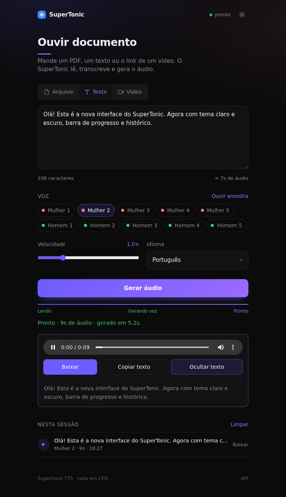

# SuperTonic — ouvir documento

Interface web + API para transformar **PDF, Word, texto, imagem, áudio ou vídeo** em áudio com vozes naturais,
usando o [Supertonic TTS](https://github.com/supertone-inc/supertonic) (ONNX, roda em CPU).



## Recursos

- 🎧 **10 vozes** (5 femininas, 5 masculinas) com prévia de cada uma
- 🌗 **Tema claro/escuro**, layout responsivo, instalável como app (PWA)
- 📄 Lê **PDF, DOCX, TXT/MD/CSV/HTML, SRT/VTT**
- 🎬 **Transcreve áudio/vídeo e links** (YouTube, MP4…) — opcional, via `faster-whisper` + `yt-dlp`
- ⚡ Velocidade (0.7×–2×), idioma, barra de progresso, histórico da sessão, `Ctrl+Enter`
- 🔐 API `/v1/*` compatível com OpenAI (`POST /v1/audio/speech`) protegida por `API_KEY`

## Rodando local

```bash
python -m venv .venv && source .venv/bin/activate
pip install -r requirements.txt
# opcional (aba Vídeo / arquivos de mídia): precisa de ffmpeg no sistema
pip install -r requirements-transcribe.txt

cp .env.example .env   # edite API_KEY
export $(grep -v '^#' .env | xargs)
python server.py       # http://localhost:8080
```

Na primeira execução o modelo (~ centenas de MB) é baixado para `HF_HOME` (padrão `/data/hf`).

## Deploy no Railway

1. Crie um projeto a partir deste repositório (o `railway.toml` já aponta para o `Dockerfile`).
2. Em **Variables**, defina `API_KEY` (e, se quiser, `DEFAULT_LANG`, `MAX_UPLOAD_MB`…).
3. Monte um **Volume** em `/data` para não baixar o modelo a cada deploy.
4. Para habilitar transcrição, no serviço → Settings → **Build Args**: `WITH_TRANSCRIBE=1`.

## Rotas

| Método | Rota | Auth | Descrição |
|---|---|---|---|
| GET | `/` | — | Interface web |
| GET | `/health` | — | `{"status": "ok"\|"loading"}` |
| GET | `/api/voices` | — | Vozes disponíveis |
| POST | `/usar` | — | Usada pela UI. Form-data: `text` **ou** `file` **ou** `url`; `voice`, `lang`, `speed`, `response_format` (`wav`/`flac`/`ogg`). Devolve áudio com o texto lido em `X-Texto` (URL-encoded); para `url` devolve JSON `{"text"}`. |
| POST | `/v1/tts` | 🔑 | TTS nativo (JSON) |
| POST | `/v1/audio/speech` | 🔑 | Alias compatível com OpenAI |
| GET | `/docs` | — | Swagger |

```bash
curl -X POST https://SEU-APP.up.railway.app/v1/audio/speech \
  -H "X-API-Key: $API_KEY" -H "Content-Type: application/json" \
  -d '{"input":"Olá, mundo!","voice":"F1","lang":"pt","response_format":"wav"}' -o fala.wav
```

## Estrutura

```
server.py                  # FastAPI: UI, /usar, /health, API key
static/                    # index.html · styles.css · app.js · PWA
requirements.txt           # supertonic[serve] + leitores de PDF/DOCX
requirements-transcribe.txt# faster-whisper + yt-dlp (opcional)
Dockerfile · start.sh · railway.toml
```

## Licença

MIT — o modelo Supertonic tem licença própria; veja o repositório oficial.
